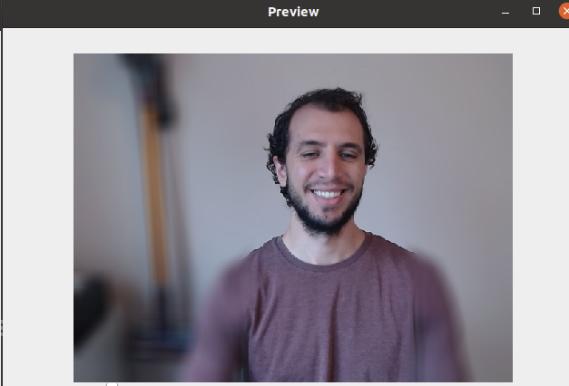
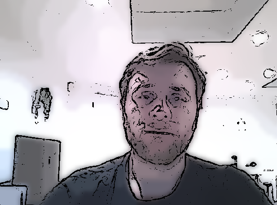
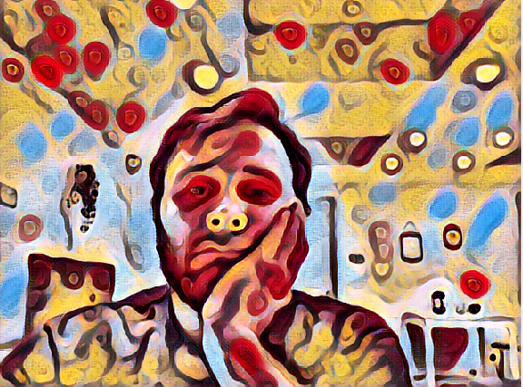

# Cameo

This project allows to apply filters while using your computer's webcam. It can
be used with any third party live streaming or video chat applications (eg.
Zoom, Hangout, Skype, etc.) by selecting the virtual video device as your webcam
device.








Current set of filters available through keyboard keys:

- face blurring (`b`)
- background blurring (`v`)
- reactions `a` -> `👏`, ')' -> 😃, '?' -> 🤔
- text "(be right back)" (`t`)
- videos (`r` -> rick roll, `y`, `w`, `s`)
- cartoon filter (`c`)
- color filter (`spacebar`)
- neural style transfer (`1`, `2`, `3`, `4`, `5`) // thanks to https://www.pyimagesearch.com/2018/08/27/neural-style-transfer-with-opencv/ and https://github.com/jcjohnson/fast-neural-style


##  Requirements

```shell
sudo apt install v4l2loopback-dkms python3-opencv python3-construct
```


## Usage

```shell
sudo modprobe v4l2loopback exclusive_caps=1
./cameo.py
```

To use Neural Style Transfer you need to download pre-trained models first. To do so:
```shell
cd models
./download-models.sh
```

### Troubleshooting

* Error: `GStreamer warning: Cannot query video position`
    * If you get this error, try uninstalling `python3-opencv` and install [opencv-python](https://pypi.org/project/opencv-python/) with pip instead.
    * Also, using a dedicated [venv](https://docs.python.org/3/tutorial/venv.html) for cameo might help.
* Error: `OSError: [Errno 22] Invalid argument`
    * This can be caused whenever the wrong output is used.
        * Try using another output device [as described here](https://github.com/jremmons/pyfakewebcam/issues/5).

## Miscellaneous commands

- List available webcams: `v4l2-ctl --list-devices`
- List supported formats: `v4l2-ctl --list-formats`
- Display a webcam with VLC: `vlc v4l2:///dev/video1`
- Stream a MP4: `ffmpeg -re -i /tmp/video1.mpeg -f v4l2 /dev/video1`
